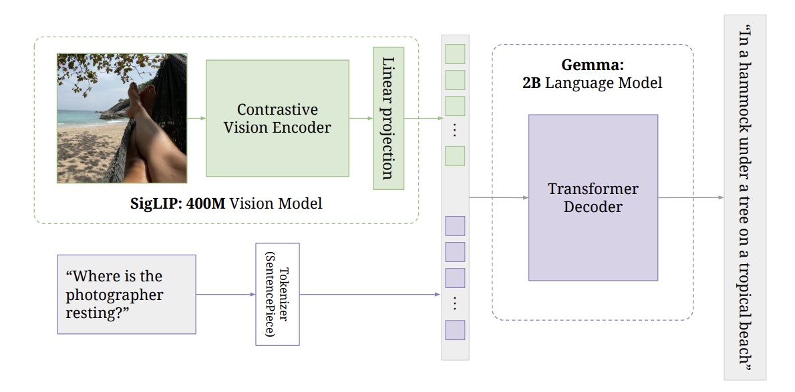

## PaliGemma implementation in PyTorch

This is a PyTorch implementation of the PeliGemma Vision-Language Model (VLM) by Google DeepMind, [PaliGemma: A versatile 3B VLM for transfer (Beyer et al., 2024)](https://arxiv.org/abs/2407.07726).

### Files

`siglip.py` implements the SigLIP model architecture.

`processing_paligemma.py` implements the preprocessing/tokenization pipeline for PaliGemma, before the inputs are passed into the SigLIP and Gemma models.

`gemma.py` implements the Gemma language model decoder, and the entire PaliGemma model.

### Architecture

